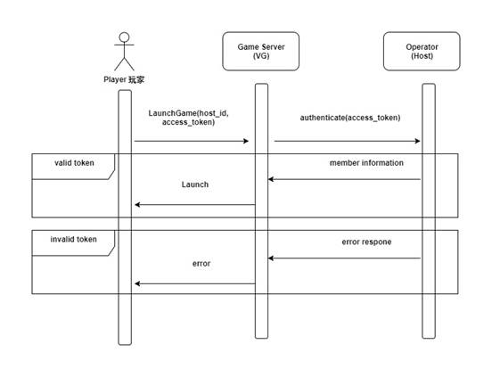

# Vela Gaming - Transfer Wallet

## Overview

This document describes the service integration between **Gaming (provider)** and a **host system / operator (host)**. The following chapters describe the general concept of integration as well as descriptions and examples of the API methods used for the service integration.

### General Notes

- Data Format: JSON (JavaScript Object Notation)
- Financial Options: Separate Wallet
- **Host** - Referred as the operator or agent party
- **Provider** - Referred as the game provider
- **Points** - Referred as the game points; not player's actual wallet balance.
- The Host manages the user account database (personal information, balance, payment operations, etc.)
- The Provider only manages the player data necessary to perform game operation.
- All methods support uses **HTTP GET** verb in the system.
- Players perform all betting and gaming by using VG Game Server's wallet system. Therefore, **Operator (host)** need to integrate VG API into your web site.

### Game Launch Process

- When player launch the game, it will call the [**Authenticate**](#api-reference-provider-to-host) API.
- You will need to provide us the [**Authenticate**](#api-reference-provider-to-host) API.
- The [**Authenticate**](#api-reference-provider-to-host) API is used by VG Game Server to retrieve players' information
- If the player is not found in VG Game Server, VG Game Server will treat it as new player and register as a new player.
- This method is called on launching the game for the logged-in player.



* * *

## API Reference (Provider to Host)

### Authenticate

Verify the access token sent from the game provider. This method is called on launching the game for the logged-in player. Despite common wallet or separate wallet approach, the **_Host_** needs to implement this API for user verification.

<!--
type: tab
title: Docs
-->

### Request

| Name         |  Type  |                                                                    Description |
| ------------ | :----: | -----------------------------------------------------------------------------: |
| access_token | string | The access token is generated by host system for the player’s current session. |
| game_code    | string |                                                                      Game code |

> ##### Example
>
> <http://{HOST_API_SERVICE}/api/user/authenticate?access_token=67812571-a5b1-456a-a1c7-e52d70355782&game_code=fish>

### Response

| Name        |  Type  |             Description |
| ----------- | :----: | ----------------------: |
| status_code |   int  |    Response status code |
| member_id   | string | Unique ID of the player |
| currency    | string |           Currency code |

#### Status Code

| Code |   Description |
| ---- | ------------: |
| 0    |       Success |
| 1    | Invalid Token |

<!--
type: tab
title: Try It
-->

```json http
{
  "method": "get",
  "url": "http://sample-host.vcfgame.com/users/authenticate",
  "query": {
    "access_token": "demo01",
    "game_code": "fish"
  }
}
```

<!--
type: tab
title: Examples
-->

### Success

```json
{
  "status_code": 0,
  "member_id": "demo01",
  "currency": "MYR"
}
```

### Error: Invalid Token

```json
{
  "status_code": 1
}
```

<!-- type: tab-end -->

* * *

## Fund Transfer (Host to Provider)

When a host wishes to use a separate account, the integration is done via a set of API offered by the game provider. Funds are deposited and witdrawn to the game provider with API calls. The relevant API calls are:

- Create Player
- Get Balance
- Deposit
- Withdraw

#### Error handling

All response should have **error** to indicate whether there is error happened. An example of error strut is as following:

```json
{
  "error": {
    "status_code": 2,
    "message": "Invalid Host ID"
  }
}
```

All **success** response should have data to indicate. An example of success strut is as following:

```json
{
  "data": {
    "status_code": 0,
    "balance": 100000
  }
}
```

### Create Player

For creating new player account, the create player API call should be used.

<!--
type: tab
title: Docs
-->

### Request

| Name      |  Type  |                                          Description |
| --------- | :----: | ---------------------------------------------------: |
| host_id   | string | Unique ID of Host System (provided by game provider) |
| member_id | string |                   Unique ID / Username of the player |
| currency  | string |                              Currency for the player |

> ##### Example
>
> [http://{PROVIDER_API_SERVICE}/api/user/create?host_id=67812571-a5b1-456a-a1c7-e52d70355782&member_id=demo01¤cy=MYR](http://{PROVIDER_API_SERVICE}/api/user/create?host_id=67812571-a5b1-456a-a1c7-e52d70355782&member_id=demo01&currency=MYR)

### Response

| Name        |  Type  |                                 Description |
| ----------- | :----: | ------------------------------------------: |
| status_code |   int  |                        Response status code |
| balance     | uint64 | Current **POINTS** of the player (in cents) |

#### Status Code

| Code |       Description |
| ---- | ----------------: |
| 0    |           Success |
| 1    | Invalid Member ID |
| 2    |   Invalid Host ID |
| 3    |  Invalid Currency |

<!--
type: tab
title: Try It
-->

```json http
{
  "method": "get",
  "url": "https://bo-stage.velachip.com/api/user/create",
  "query": {
    "host_id": "demo01",
    "member_id": "fish",
    "currency": "MYR"
  }
}
```

<!--
type: tab
title: Examples
-->

### Sample Success Response

```json
{
  "data": {
    "status_code": 0,
    "balance": 100000
  }
}
```

### Sample Error Response

```json
{
  "error": {
    "status_code": 2,
    "message": "Invalid Host ID"
  }
}
```

<!-- type: tab-end -->
